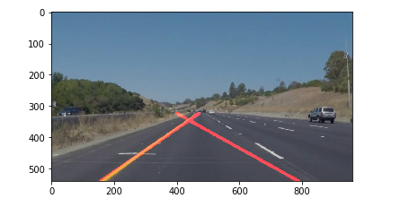
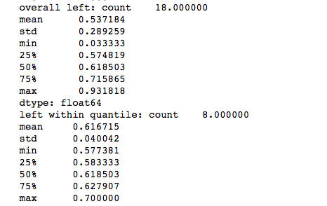
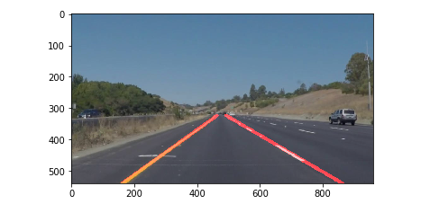

#**Finding Lane Lines on the Road** 

##Writeup Template

###You can use this file as a template for your writeup if you want to submit it as a markdown file. But feel free to use some other method and submit a pdf if you prefer.

---

**Finding Lane Lines on the Road**

The goals / steps of this project are the following:
* Make a pipeline that finds lane lines on the road
* Reflect on your work in a written report

[//]: # (Image References)

[image1]: ./examples/grayscale.jpg "Grayscale"

---

### Reflection

###1. Describe your pipeline. As part of the description, explain how you modified the draw_lines() function.

My pipeline consisted of the following steps
 * Convert to grayscale
 * Apply canny edge detection
 * Add a region of interest mask
 * Apply hough transform to identify lines
 * Once we identify lines, apply additional processing to draw single line for left and right lane.

In order to draw a single line on the left and right lanes, I modified the draw_lines() function to do the following:
 * group all identified lines, each represented as a  pair of points, into left lane or right lane using slope. If slope is negative, it is part of right lane, else it is part of left lane.
 * average the x and y co-ordinates for all the lines in left lane group, and all the lines in right lane group. Now we have one line representation for left and one for right.
 * identify the y-limits based on region of interest vertices, and compute the x-coordinate using equation of line
 * Now we have one line for left and right covering the whole region of interest range.

This worked well for the first video (white). But for the second video (yellow) it was off for many scenes and for the last optional challenge, it was almost always off.

I made the pipeline more robust by doing the following:
 * region of interest selection was hardcoded first. I used percentages on the image size instead of hardcoded absolute numbers.
 * there were some scenes where one or two random lines on the road will change the line direction drastically. I made this part more robust by trying two things:
  * include only those lines whose slopes are between 25th and 75th percentile of the slopes of left or right lanes. 
  * use median instead of mean.
 * both the above methods made the yellow result much better and the final challenge problem also improved but there is still a lot of room for improvement there.

One of the things I enjoyed learning about is taking snapshot images from a video and running the pipeline through some selected images. This helped iterate faster on the robustness tweakings. I plotted the image after every step which helped me identify some of the issues.

One example snapshot from the second movie, which showed a problem:

These stats show how skewed the slope numbers were. Things improve if I remove outliers (keep only lines corresponding to slopes with 25th-75th quantile):

After I did the above pruning of outliers, the results look better:

Similar results with couple of snapshots from the challenge video.

###2. Identify potential shortcomings with your current pipeline
* This representation will break when we have perfectly vertical lines. May be I can use polar coordinates representation for line.
* Optional challenge is not very well solved still. Many images in that video are still not handled well.
* A little tedious to identify problematic images within a video.

###3. Suggest possible improvements to your pipeline

* Polar co-ordinates representation for line.
* Dig more into issues in the optional challenge. I tried two ways of making the aggregate more robust: median, and average after pruning outliers. I can experiment with more variants to identify something even more robust. (e.g: identify lines with median slope and use only those, don't prune if there are only very few lines for each lane, including  an absolute range for slope might be an easy way to address the issue).
* To identify problem images within video faster, we can try to add some heuristics to identify when issues happen. One heuristic for example is when the identified lane segments intersect within the region of interest. This can be easily computed and automated to identify problematic images automatically. We can even keep a % score to capture the quality of our lane finding (just one heuristic to do semi-automatic labeling).

